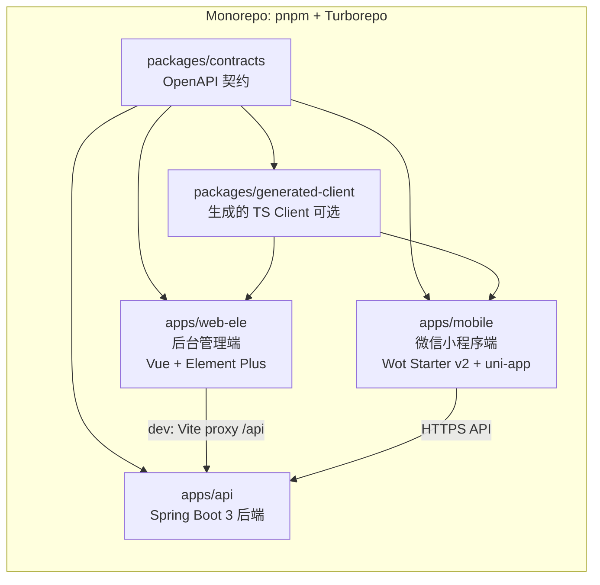
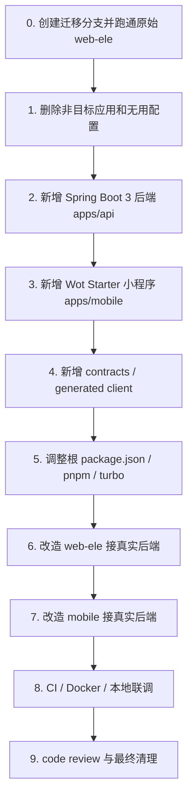
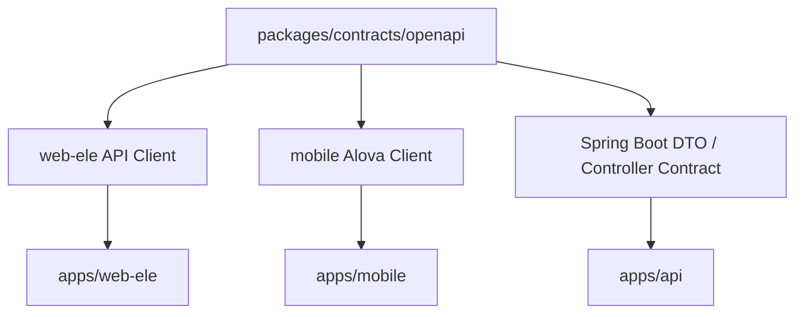
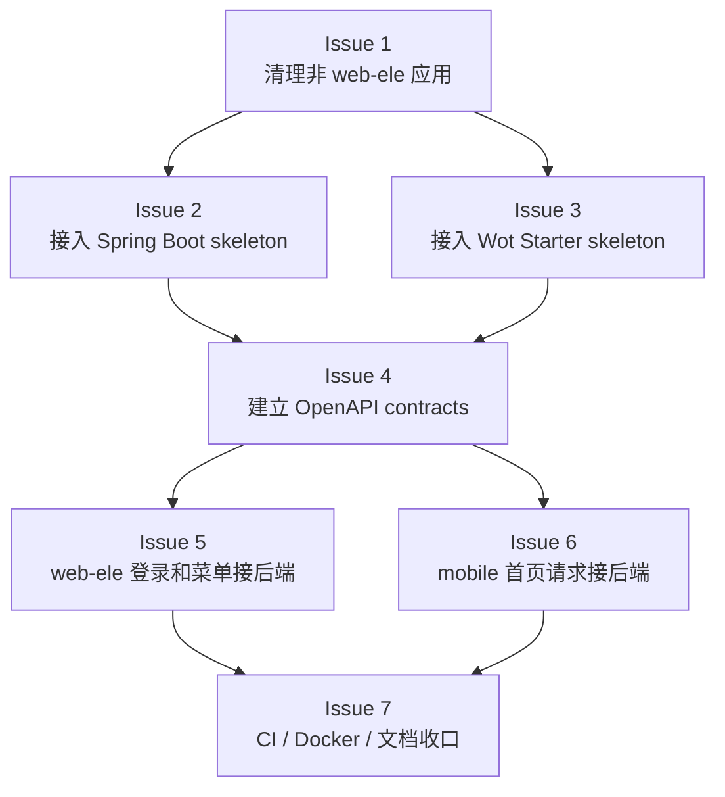
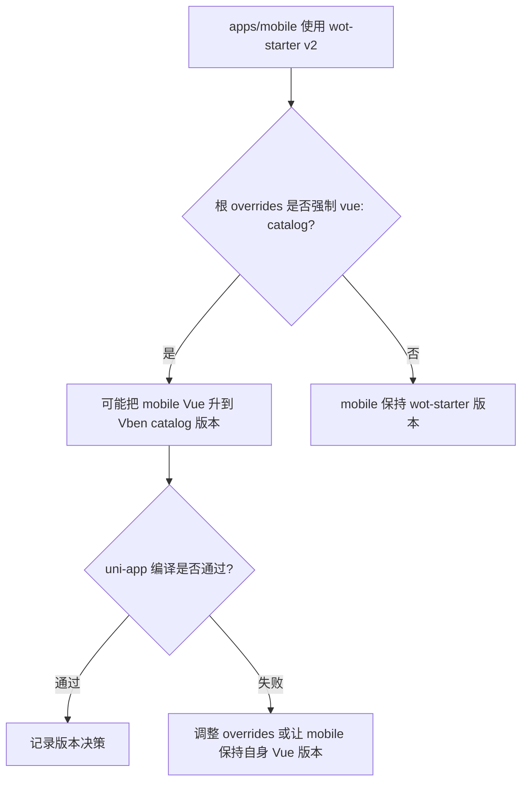

# 基于 vue-vben-admin 改造成 Admin Web + Spring Boot 3 + Wot Starter 微信小程序的执行计划

> 目标：以 `vbenjs/vue-vben-admin` 作为 Turborepo monorepo 基础，只保留 `apps/web-ele` 作为后台管理端，引入 `Spring Boot 3` 后端项目，并把 `wot-ui/wot-starter` 的 `v2` 分支作为微信小程序端接入同一个仓库。
>
> 本文档重点是“执行计划”，不是最终代码。顺序遵循：**先删除、再新增、再调整、最后验证**。

---

## 0. 依据与前提

### 0.1 当前仓库事实

- `vue-vben-admin` 当前是 `5.7.0`，根项目使用 `pnpm@11.7.0`，并要求 Node `^22.18.0 || ^24.0.0`。
- `apps/` 下当前包含：
  - `backend-mock`
  - `web-antd`
  - `web-antdv-next`
  - `web-ele`
  - `web-naive`
  - `web-tdesign`
- `apps/web-ele` 的包名是 `@vben/web-ele`，技术栈是 Vue + Element Plus。
- `apps/web-ele/.env.development` 当前 `VITE_GLOB_API_URL=/api`，并且 `VITE_NITRO_MOCK=true`。
- `wot-starter v2` 是一个独立的 uni-app 项目，包含 `src`、`vite.config.ts`、`pages.config.ts`、`manifest.config.ts`、`uno.config.ts`、`alova.config.ts` 等根级工程文件。
- Wot UI V2 支持微信小程序、支付宝小程序、钉钉小程序、H5、APP 等多端，但本计划只把它作为**微信小程序端**使用。

### 0.2 目标结构

```text
repo/
├── apps/
│   ├── web-ele/                 # 保留：后台管理端，Element Plus 版本
│   ├── api/                     # 新增：Spring Boot 3 后端
│   └── mobile/                  # 新增：Wot Starter v2 微信小程序端
├── packages/
│   ├── contracts/               # 新增：OpenAPI / 共享接口契约
│   ├── generated-client/         # 可选：生成给 web-ele / mobile 用的 TS client
│   └── ...                      # 保留 web-ele 依赖的 Vben 内部包
├── docs/
│   ├── architecture/
│   ├── adr/
│   └── agents/
├── turbo.json
├── pnpm-workspace.yaml
└── package.json
```

### 0.3 关键原则

```text
不要把 Spring Boot 强行改造成 JS 项目；
只需要给它一个 package.json 外壳，让 Turborepo 能调度 Maven 脚本。
```

```text
不要把 wot-starter 的根目录配置直接覆盖到 vben 根目录；
应该把它作为 apps/mobile 迁入。
```

```text
不要急着删除 packages/*；
web-ele 依赖大量 @vben/* workspace 包，先保留，等 build 通过后再做依赖剪枝。
```

---

## 1. 总体架构图



---

## 2. 执行总顺序



---

# 第一部分：先删除的内容

## 3. 删除前准备

### 3.1 创建迁移分支

```bash
git checkout -b chore/monorepo-admin-api-mobile
```

**为什么：** 这类迁移会同时动根配置、应用目录、CI、lockfile，必须在独立分支里完成，方便回滚和分阶段 review。

### 3.2 先跑通现有 `web-ele`

```bash
corepack enable
pnpm install
pnpm dev:ele
pnpm build:ele
```

**为什么：** 删除前先建立 baseline。后续失败时能判断是原项目问题还是迁移引入的问题。

---

## 4. 删除其他后台 UI 应用

### 4.1 删除目录

删除：

```text
apps/web-antd
apps/web-antdv-next
apps/web-naive
apps/web-tdesign
```

保留：

```text
apps/web-ele
```

**为什么：** 你的目标是“后台只保留 web-ele”。保留多套 UI 版本会导致依赖、构建、CI、Agent 上下文都变复杂。AI Agent 在实现后台功能时，也更容易误改其他 UI app。

### 4.2 删除根 `package.json` 中对应脚本

删除：

```jsonc
{
  "build:antd": "...",
  "build:naive": "...",
  "build:tdesign": "...",
  "dev:antd": "...",
  "dev:antdv-next": "...",
  "dev:naive": "...",
  "dev:tdesign": "..."
}
```

保留并后续可重命名：

```jsonc
{
  "build:ele": "pnpm run build --filter=@vben/web-ele",
  "dev:ele": "pnpm -F @vben/web-ele run dev"
}
```

**为什么：** 删除应用目录后，如果根 scripts 还指向这些 workspace，`pnpm run`、CI 或 Agent 自动执行脚本时会失败。

建议后续改成更业务化的名字：

```jsonc
{
  "dev:admin": "pnpm -F @vben/web-ele run dev",
  "build:admin": "pnpm run build --filter=@vben/web-ele"
}
```

---

## 5. 删除 Nitro Mock 后端

### 5.1 删除目录

删除：

```text
apps/backend-mock
```

**为什么：** 目标后端是 Spring Boot 3。继续保留 Nitro Mock 会制造两个后端入口，容易出现“开发时走 mock、生产走真实后端”的分裂。

### 5.2 删除 `turbo.json` 中的 backend-mock 专用配置

删除：

```jsonc
{
  "@vben/backend-mock#build": {
    "dependsOn": ["^build"],
    "outputs": [".nitro/**", ".output/**"]
  }
}
```

**为什么：** `apps/backend-mock` 删除后，这个 target 没有意义；保留会让 turbo 配置表达错误的项目结构。

### 5.3 调整 `apps/web-ele/.env.*`

把：

```env
VITE_NITRO_MOCK=true
```

改成：

```env
VITE_NITRO_MOCK=false
```

**为什么：** 明确后台管理端不再启动 Nitro Mock，而是通过 `/api` 访问 Spring Boot。

---

## 6. 删除 Vben 原始文档站和 playground

### 6.1 删除目录

如果你的项目不需要保留 Vben 官方文档站和演示 playground，删除：

```text
docs
playground
```

然后重新创建项目自己的文档目录：

```text
docs/
├── architecture/
├── adr/
├── contracts/
└── agents/
```

**为什么：** Vben 原始 `docs` 更像模板说明文档，不是你业务项目的工程文档。删除后重新建立业务文档，可以减少噪音。

### 6.2 删除根 `package.json` 对应脚本

删除：

```jsonc
{
  "build:docs": "...",
  "dev:docs": "...",
  "build:play": "...",
  "dev:play": "..."
}
```

**为什么：** 目录删除后脚本也应删除，否则 CI 和本地命令会报错。

### 6.3 调整 `pnpm-workspace.yaml`

删除：

```yaml
- docs
- playground
```

保留：

```yaml
- apps/*
- packages/*
- packages/@core/base/*
- packages/@core/ui-kit/*
- packages/@core/forward/*
- packages/@core/*
- packages/effects/*
- packages/business/*
- internal/*
- internal/lint-configs/*
- scripts/*
```

**为什么：** `docs` 和 `playground` 删除后不应继续作为 workspace package。

### 6.4 调整 `turbo.json` build outputs

如果删除 VitePress docs，删除这些输出：

```jsonc
".vitepress/dist.zip",
".vitepress/dist/**"
```

**为什么：** 这些只服务于原 docs 应用，删除后保留没有价值。

---

## 7. 删除或延后处理 Changeset / 发布相关配置

### 7.1 可选删除

如果你的团队不会把内部包发布成 npm 包，可以删除：

```text
.changeset
```

并从根 `package.json` 删除：

```jsonc
{
  "changeset": "...",
  "version": "..."
}
```

同时删除不再需要的 devDependencies：

```text
@changesets/changelog-github
@changesets/cli
```

**为什么：** 业务项目通常不需要 changeset 发布流。保留也可以，但 AI Agent 可能误以为每次业务功能都要走 package release。

> 建议：如果你后续要发布 `packages/*` 内部 SDK，再保留 Changeset；否则先删。

---

## 8. 删除 Vben 示例性或无关配置

### 8.1 可选删除

按实际需要删除：

```text
.gitpod.yml
tea.yaml
scripts/deploy/build-local-docker-image.sh
```

**为什么：** 如果团队不用 Gitpod、不用 tea、不沿用 Vben 的 Docker 镜像构建脚本，保留只会增加认知负担。

### 8.2 删除 `index.html` 中的统计脚本

检查：

```text
apps/web-ele/index.html
```

如果存在百度统计等模板示例脚本，删除。

**为什么：** 这属于模板示例代码，不应该进入真实业务项目。

---

## 9. 删除 Wot Starter 迁入时不应该合并的根配置

从 `wot-starter v2` 迁入时，**不要把这些文件直接覆盖到 monorepo 根目录**：

```text
.agents/
.github/
.husky/
.vscode/
docs/
.editorconfig
.gitignore
.npmrc
.nvmrc
.git-cz.json
.versionrc
CHANGELOG.md
LICENSE
README.md
commitlint.config.js
eslint.config.mjs
pnpm-lock.yaml
pnpm-workspace.yaml
renovate.json
skills-lock.json
```

**为什么：** 这些是 wot-starter 作为独立项目时的根配置。当前根项目应该继续以 `vue-vben-admin` 的 monorepo 配置为主，只把 wot-starter 作为 `apps/mobile` 应用迁入。

可以迁入到 `apps/mobile` 的内容：

```text
src/
index.html
manifest.config.ts
pages.config.ts
vite.config.ts
uno.config.ts
alova.config.ts
tsconfig.json
tsconfig.base.json
.env.development
.env.production
.env.staging
package.json
```

---

## 10. 精简 Wot Starter 的非微信端内容

如果项目只做微信小程序，可以从 `apps/mobile/package.json` 中删除非微信平台 scripts：

```jsonc
{
  "dev:app": "...",
  "dev:app-android": "...",
  "dev:app-ios": "...",
  "dev:mp-alipay": "...",
  "dev:mp-baidu": "...",
  "dev:mp-kuaishou": "...",
  "dev:mp-lark": "...",
  "dev:mp-qq": "...",
  "dev:mp-toutiao": "...",
  "dev:quickapp-webview": "...",
  "build:app": "...",
  "build:app-android": "...",
  "build:app-ios": "...",
  "build:mp-alipay": "...",
  "build:mp-baidu": "...",
  "build:mp-kuaishou": "...",
  "build:mp-lark": "...",
  "build:mp-qq": "...",
  "build:mp-toutiao": "...",
  "build:quickapp-webview": "..."
}
```

建议保留：

```jsonc
{
  "dev:mp-weixin": "uni -p mp-weixin",
  "build:mp-weixin": "uni build -p mp-weixin",
  "typecheck": "vue-tsc --noEmit",
  "lint": "eslint .",
  "alova-gen": "alova gen -f"
}
```

可选保留 H5：

```jsonc
{
  "dev:h5": "uni",
  "build:h5": "uni build"
}
```

**为什么：** wot-starter 是多端模板，但你的目标是微信小程序端。删除无关平台脚本可以降低安装依赖、CI 时间和 Agent 误操作概率。

---

## 11. 不建议第一轮删除的内容

不要一开始删除：

```text
packages/*
packages/@core/*
packages/business/*
packages/effects/*
internal/*
scripts/*
```

**为什么：** `apps/web-ele` 依赖大量 `@vben/*` workspace 包，例如 access、common-ui、constants、hooks、icons、layouts、locales、plugins、preferences、request、stores、styles、types、utils 等。先删这些包会导致 web-ele 大面积失效。

正确做法：

```bash
pnpm build:admin
pnpm check
```

在确认 `web-ele` 正常后，再用依赖分析做第二轮清理。

---

# 第二部分：新增内容

## 12. 新增 Spring Boot 3 后端 `apps/api`

### 12.1 新增目录

```text
apps/api/
├── package.json
├── pom.xml
├── mvnw
├── mvnw.cmd
├── .mvn/
│   └── wrapper/
├── src/
│   ├── main/
│   │   ├── java/com/example/app/
│   │   │   ├── Application.java
│   │   │   ├── common/
│   │   │   ├── config/
│   │   │   ├── security/
│   │   │   ├── modules/
│   │   │   │   ├── iam/
│   │   │   │   ├── system/
│   │   │   │   └── admin/
│   │   │   └── openapi/
│   │   └── resources/
│   │       ├── application.yml
│   │       ├── application-dev.yml
│   │       └── db/migration/
│   └── test/
└── README.md
```

**为什么：** 后端作为独立 app 放到 `apps/api`，和 `apps/web-ele`、`apps/mobile` 同级。Turborepo 不直接管理 Java 构建细节，只负责调度脚本。

### 12.2 新增 `apps/api/package.json`

示例：

```json
{
  "name": "@app/api",
  "private": true,
  "scripts": {
    "dev": "node scripts/maven.cjs spring-boot:run",
    "build": "node scripts/maven.cjs -DskipTests package",
    "test": "node scripts/maven.cjs test",
    "clean": "node scripts/maven.cjs clean",
    "typecheck": "node scripts/maven.cjs -DskipTests compile"
  }
}
```

如果不想写 `scripts/maven.cjs`，也可以直接写：

```json
{
  "scripts": {
    "dev": "./mvnw spring-boot:run",
    "build": "./mvnw -DskipTests package",
    "test": "./mvnw test"
  }
}
```

**为什么：** 跨平台团队建议用 Node wrapper 自动选择 `mvnw` 或 `mvnw.cmd`。这样 Windows、macOS、Linux 都能通过同一组 pnpm/turbo 命令运行。

### 12.3 Spring Boot 版本建议

建议：

```text
Spring Boot 3.5.x
Java 21
Maven Wrapper
```

最低要求：

```text
Spring Boot 3.x 至少需要 Java 17。
```

**为什么：** Java 21 是当前常见 LTS 选择，和 Spring Boot 3.x 兼容性好。团队如果有 Spring Cloud 版本约束，可以根据 Spring Cloud release train 选择 3.4.x 或 3.5.x。

### 12.4 后端第一阶段接口

先实现这些最小接口：

```text
GET  /api/health
POST /api/auth/login
GET  /api/user/info
GET  /api/menu/list
POST /api/auth/logout
```

**为什么：** 先满足 `web-ele` 登录、用户信息、菜单权限这些基础闭环，再逐步迁移业务模块。

---

## 13. 新增 Wot Starter 小程序 `apps/mobile`

### 13.1 新增目录

```text
apps/mobile/
├── package.json
├── index.html
├── manifest.config.ts
├── pages.config.ts
├── vite.config.ts
├── uno.config.ts
├── alova.config.ts
├── tsconfig.json
├── tsconfig.base.json
├── .env.development
├── .env.production
├── .env.staging
└── src/
```

**为什么：** wot-starter 是一个完整 uni-app 应用，不应该拆散到 `packages`。放在 `apps/mobile` 可以和 `apps/web-ele`、`apps/api` 形成清晰的产品应用边界。

### 13.2 修改 `apps/mobile/package.json`

从 wot-starter 迁入后，建议改成：

```json
{
  "name": "@app/mobile",
  "private": true,
  "type": "module",
  "scripts": {
    "dev": "uni -p mp-weixin",
    "dev:mp-weixin": "uni -p mp-weixin",
    "build": "uni build -p mp-weixin",
    "build:mp-weixin": "uni build -p mp-weixin",
    "typecheck": "vue-tsc --noEmit",
    "lint": "eslint .",
    "alova-gen": "alova gen -f"
  }
}
```

删除子包中的：

```jsonc
{
  "packageManager": "pnpm@9.9.0",
  "prepare": "husky install",
  "commit": "git-cz",
  "release-major": "...",
  "release-minor": "...",
  "release-patch": "..."
}
```

**为什么：** 根 monorepo 已经统一使用 `pnpm@11.7.0`、统一管理 Git hooks 和提交规范。子应用不应该再次安装 husky 或指定不同 package manager。

### 13.3 小程序输出目录

uni-app 微信小程序开发输出一般在：

```text
apps/mobile/dist/dev/mp-weixin
```

生产构建输出一般在：

```text
apps/mobile/dist/build/mp-weixin
```

**为什么：** 微信开发者工具需要导入构建后的 `mp-weixin` 目录，而不是直接导入 monorepo 根目录。

---

## 14. 新增接口契约 `packages/contracts`

### 14.1 新增目录

```text
packages/contracts/
├── package.json
├── openapi/
│   ├── admin.openapi.yaml
│   ├── mobile.openapi.yaml
│   └── common.schemas.yaml
└── README.md
```

**为什么：** 前端后台、小程序、Spring Boot 后端都依赖同一组 API 约定。把 contract 放进 `packages/contracts`，可以避免“前端猜字段、后端猜字段”。

### 14.2 Contract 关系图



### 14.3 最小 contract 示例

```yaml
openapi: 3.0.3
info:
  title: Admin API
  version: 0.1.0
paths:
  /api/health:
    get:
      summary: Health check
      responses:
        '200':
          description: OK
  /api/auth/login:
    post:
      summary: Admin login
      requestBody:
        required: true
      responses:
        '200':
          description: Login result
```

**为什么：** 先从登录、用户信息、菜单权限、健康检查开始建 contract，后续业务功能逐个 vertical slice 增加。

---

## 15. 新增本地基础设施

建议新增：

```text
docker-compose.yml
infra/
├── mysql/
├── redis/
└── nginx/
```

`docker-compose.yml` 第一版只需要：

```text
mysql
redis
```

**为什么：** 后端本地运行需要数据库和缓存。先用 Docker Compose 提供最小环境，避免每个开发者手动安装。

---

## 16. 新增项目文档

新增：

```text
CONTEXT.md
docs/adr/
docs/architecture/
docs/contracts/
docs/agents/
```

示例：

```text
docs/adr/0001-use-monorepo-for-admin-api-mobile.md
docs/adr/0002-use-openapi-as-frontend-backend-contract.md
docs/adr/0003-use-spring-boot-3-for-backend.md
```

**为什么：** 这个仓库会同时包含后台、小程序、后端和共享 contract。必须把术语、边界、重要取舍写下来，避免 AI Agent 在 issue 实现时猜测。

---

# 第三部分：调整内容

## 17. 调整根 `package.json`

### 17.1 推荐 scripts

```json
{
  "scripts": {
    "bootstrap": "pnpm install",
    "dev": "turbo run dev --filter=@vben/web-ele --filter=@app/api",
    "dev:admin": "pnpm -F @vben/web-ele run dev",
    "dev:api": "pnpm -F @app/api run dev",
    "dev:mobile": "pnpm -F @app/mobile run dev:mp-weixin",
    "build": "turbo run build",
    "build:admin": "pnpm run build --filter=@vben/web-ele",
    "build:api": "pnpm -F @app/api run build",
    "build:mobile": "pnpm -F @app/mobile run build:mp-weixin",
    "check": "pnpm run check:type && pnpm run lint",
    "check:type": "turbo run typecheck",
    "test": "turbo run test",
    "clean": "node ./scripts/clean.mjs"
  }
}
```

**为什么：** 根脚本只做任务分发，不把 Java、Vue、uni-app 的具体构建逻辑写在根目录。具体逻辑放在各自 app 的 `package.json` 中。

---

## 18. 调整 `pnpm-workspace.yaml`

推荐保持：

```yaml
packages:
  - internal/*
  - internal/lint-configs/*
  - packages/*
  - packages/@core/base/*
  - packages/@core/ui-kit/*
  - packages/@core/forward/*
  - packages/@core/*
  - packages/effects/*
  - packages/business/*
  - apps/*
  - scripts/*
```

删除：

```yaml
- docs
- playground
```

### 18.1 特别注意 Vue 版本覆盖

Vben 根 `pnpm-workspace.yaml` 中有类似：

```yaml
overrides:
  vue: catalog:
```

而 wot-starter v2 的 `package.json` 中 Vue 版本较保守，例如：

```json
"vue": "~3.4.38"
```

这里有风险：

```text
如果根 overrides 强制把 mobile 的 vue 也覆盖到 Vben catalog 版本，
可能导致 uni-app / @dcloudio 生态不兼容。
```

处理建议：

1. 第一轮迁移时不要把 `apps/mobile` 的 Vue 改成 `catalog:`。
2. 跑 `pnpm -F @app/mobile dev:mp-weixin` 验证能否编译。
3. 如果因为根 overrides 导致版本问题，优先调整 overrides，不要强行升级 Wot Starter 的 Vue。
4. 稳定后再决定是否统一 Vue 版本。

**为什么：** 后台 Web 和 uni-app 小程序处在不同生态，强行统一 Vue 小版本不一定收益大，反而可能引入编译问题。

---

## 19. 调整 `turbo.json`

### 19.1 推荐配置方向

```jsonc
{
  "$schema": "https://turbo.build/schema.json",
  "globalDependencies": [
    "pnpm-lock.yaml",
    "**/.env.*local",
    "**/tsconfig*.json",
    "**/pom.xml",
    "**/mvnw",
    "**/mvnw.cmd"
  ],
  "globalEnv": [
    "NODE_ENV",
    "SPRING_PROFILES_ACTIVE"
  ],
  "tasks": {
    "build": {
      "dependsOn": ["^build"],
      "outputs": [
        "dist/**",
        "dist.zip",
        "target/**",
        "build/libs/**"
      ]
    },
    "dev": {
      "cache": false,
      "persistent": true,
      "outputs": []
    },
    "typecheck": {
      "outputs": []
    },
    "test": {
      "outputs": []
    },
    "@app/api#build": {
      "outputs": ["target/**"]
    },
    "@app/mobile#build": {
      "outputs": ["dist/build/**"]
    }
  }
}
```

**为什么：** Turborepo 调度的是 `package.json` scripts。Java 的 Maven 输出在 `target/**`，uni-app 输出在 `dist/**`，所以 turbo 的 outputs 要覆盖这些目录。

### 19.2 不建议做的事

不要在根 `package.json` 写：

```json
{
  "dev:api": "cd apps/api && ./mvnw spring-boot:run"
}
```

更推荐：

```json
{
  "dev:api": "pnpm -F @app/api run dev"
}
```

**为什么：** Turborepo 的价值在于 package task graph。任务逻辑应该在 package 内，根脚本只做 filter 和调度。

---

## 20. 调整 `apps/web-ele`

### 20.1 关闭 mock，指向 Spring Boot

`apps/web-ele/.env.development`：

```env
VITE_PORT=5777
VITE_BASE=/
VITE_GLOB_API_URL=/api
VITE_NITRO_MOCK=false
VITE_DEVTOOLS=false
VITE_INJECT_APP_LOADING=true
```

**为什么：** 后台管理端本地仍通过 `/api` 请求，Vite proxy 转发到 Spring Boot，避免浏览器跨域问题。

### 20.2 配置 Vite proxy

检查 `apps/web-ele/vite.config.ts` 或 Vben 的 vite config 扩展点，确保开发代理指向：

```text
http://localhost:8080
```

期望：

```text
http://localhost:5777/api/auth/login
  -> http://localhost:8080/api/auth/login
```

**为什么：** 前端环境变量保持 `/api`，后端实际端口独立，方便本地开发和生产部署。

### 20.3 替换 mock API 适配层

优先处理这些模块：

```text
登录
用户信息
菜单权限
按钮权限
登出
```

**为什么：** 这是后台系统启动后的最小闭环。先让登录和菜单跑通，再迁移业务模块。

### 20.4 统一响应格式

建议后端兼容 Vben 前端期望的响应格式，例如：

```json
{
  "code": 0,
  "data": {},
  "message": "ok"
}
```

或者在 `@vben/request` 层做一次适配。

**为什么：** 不建议在每个页面里处理不同后端格式。统一在 request adapter 层处理，影响面最小。

---

## 21. 调整 `apps/api`

### 21.1 后端最小模块

```text
common      通用响应、异常、分页、错误码
config      Spring 配置
security    JWT / 权限 / CORS
modules/iam 登录、用户、角色、权限
modules/system 菜单、字典、配置
openapi     contract / Swagger 配置
```

**为什么：** 后台管理系统最先需要的是认证、用户、菜单、权限。业务模块可以后续逐步加入。

### 21.2 后端本地配置

`application-dev.yml`：

```yaml
server:
  port: 8080

spring:
  profiles:
    active: dev
  datasource:
    url: jdbc:mysql://localhost:3306/app?useSSL=false&serverTimezone=UTC
    username: app
    password: app

app:
  cors:
    allowed-origins:
      - http://localhost:5777
```

**为什么：** 管理后台本地端口是 `5777`，后端需要允许本地开发访问。如果前端用 Vite proxy，CORS 压力较小；但直接调试 API 或移动端 H5 时仍需要 CORS。

### 21.3 微信小程序注意点

微信小程序真机请求不走浏览器 CORS，但有：

```text
- 合法域名配置
- HTTPS 要求
- 本地开发者工具 request domain 设置
```

**为什么：** 小程序端联调失败时，常见原因不是后端 CORS，而是微信平台域名或证书限制。

---

## 22. 调整 `apps/mobile`

### 22.1 配置小程序 appid

在：

```text
apps/mobile/manifest.config.ts
```

配置微信小程序：

```ts
mp-weixin: {
  appid: '你的微信小程序 appid'
}
```

**为什么：** 微信开发者工具需要 appid 才能完整调试登录、订阅消息、支付等能力。

### 22.2 配置 API base

`apps/mobile/.env.development`：

```env
VITE_API_BASE_URL=http://localhost:8080/api
```

生产：

```env
VITE_API_BASE_URL=https://api.example.com/api
```

**为什么：** 小程序没有 Vite dev proxy 的同等运行方式，API base 要明确配置。

### 22.3 改造 alova 请求层

使用 `alova` 统一处理：

```text
- baseURL
- token 注入
- 401 处理
- 业务错误码
- loading / toast
```

**为什么：** Wot Starter 已内置 Alova 工程能力，移动端请求不应散落在页面组件中。

---

## 23. 新增 OpenAPI 生成流程

### 23.1 contracts scripts

`packages/contracts/package.json`：

```json
{
  "name": "@app/contracts",
  "private": true,
  "scripts": {
    "lint": "redocly lint openapi/*.yaml",
    "generate:web": "openapi-generator-cli generate -i openapi/admin.openapi.yaml -g typescript-axios -o ../generated-client/admin",
    "generate:mobile": "openapi-generator-cli generate -i openapi/mobile.openapi.yaml -g typescript-fetch -o ../generated-client/mobile"
  }
}
```

也可以选择：

```text
- web-ele：使用现有 @vben/request 封装，不强依赖 axios generator
- mobile：继续使用 wot-starter 的 alova-gen
- backend：使用 springdoc 暴露 OpenAPI，再对比 contract
```

**为什么：** 关键不是用哪个生成器，而是 contract 必须先于前后端实现稳定下来。

---

## 24. 调整 CI

### 24.1 GitHub Actions 需要支持 Node + Java

CI 应包含：

```text
- setup-node
- corepack enable
- pnpm install
- setup-java 21
- Maven cache
- pnpm build:admin
- pnpm build:api
- pnpm build:mobile
- pnpm test
```

**为什么：** 现在仓库是多语言 monorepo。CI 不能只懂前端，也不能只跑 Spring Boot。

### 24.2 第一版 CI 命令

```bash
pnpm install --frozen-lockfile
pnpm build:admin
pnpm build:api
pnpm build:mobile
pnpm test
```

如果移动端构建受微信环境影响，可以先在 CI 中跑：

```bash
pnpm -F @app/mobile run typecheck
```

再把 `build:mp-weixin` 放到单独 job。

**为什么：** 先确保类型检查稳定，再逐步纳入完整小程序构建。

---

## 25. 调整 VS Code 工作区

更新：

```text
vben-admin.code-workspace
```

建议包含：

```json
{
  "folders": [
    { "name": "root", "path": "." },
    { "name": "admin", "path": "apps/web-ele" },
    { "name": "api", "path": "apps/api" },
    { "name": "mobile", "path": "apps/mobile" }
  ]
}
```

**为什么：** 多语言项目需要 IDE 明确识别前端、后端、小程序目录，减少索引和插件误判。

---

# 第四部分：推荐分阶段落地计划

## 26. 阶段 1：只保留 web-ele

目标：

```text
删除其他 UI app、backend-mock、docs、playground，web-ele 仍能启动和构建。
```

操作：

```bash
rm -rf apps/web-antd apps/web-antdv-next apps/web-naive apps/web-tdesign
rm -rf apps/backend-mock
rm -rf docs playground
```

然后调整：

```text
package.json
pnpm-workspace.yaml
turbo.json
apps/web-ele/.env.development
```

验证：

```bash
pnpm install
pnpm dev:admin
pnpm build:admin
```

完成标准：

```text
- pnpm dev:admin 能启动
- pnpm build:admin 能通过
- 根 scripts 不再出现 antd / naive / tdesign / backend-mock / docs / playground
```

---

## 27. 阶段 2：接入 Spring Boot 3 skeleton

目标：

```text
apps/api 可以被 Turborepo 调度，并提供 /api/health。
```

操作：

```text
新增 apps/api
新增 Maven Wrapper
新增 apps/api/package.json
新增 GET /api/health
调整 turbo.json outputs
调整根 package.json scripts
```

验证：

```bash
pnpm dev:api
curl http://localhost:8080/api/health
pnpm build:api
```

完成标准：

```text
- Spring Boot 能本地启动
- /api/health 返回 ok
- pnpm build:api 通过
- turbo run build 能识别 api package
```

---

## 28. 阶段 3：接入 Wot Starter v2 skeleton

目标：

```text
apps/mobile 可以编译微信小程序。
```

操作：

```text
从 wot-starter v2 迁入 app 文件到 apps/mobile
重命名 package 为 @app/mobile
删除子项目 packageManager / husky / release scripts
保留 dev:mp-weixin / build:mp-weixin
调整 manifest.config.ts appid
```

验证：

```bash
pnpm -F @app/mobile run dev:mp-weixin
```

然后用微信开发者工具导入：

```text
apps/mobile/dist/dev/mp-weixin
```

完成标准：

```text
- 小程序 dev 构建成功
- 微信开发者工具可打开
- 首页可渲染
```

---

## 29. 阶段 4：建立 contract-first 流程

目标：

```text
前端后台、小程序、后端不再各自猜 API 字段。
```

操作：

```text
新增 packages/contracts
新增 admin.openapi.yaml
新增 mobile.openapi.yaml
新增 login / user-info / menu / health contract
接入生成脚本或 contract lint
```

验证：

```bash
pnpm -F @app/contracts run lint
pnpm -F @app/contracts run generate:web
pnpm -F @app/contracts run generate:mobile
```

完成标准：

```text
- contract 文件进入仓库
- web-ele 和 mobile 都引用同一份 contract 或生成物
- backend 实现与 contract 对齐
```

---

## 30. 阶段 5：后台管理端接 Spring Boot

目标：

```text
web-ele 登录、用户信息、菜单权限走 Spring Boot。
```

操作：

```text
Spring Boot 实现 /api/auth/login
Spring Boot 实现 /api/user/info
Spring Boot 实现 /api/menu/list
web-ele request adapter 适配后端响应
web-ele 关闭 Nitro Mock
web-ele Vite proxy 指向 8080
```

验证：

```bash
pnpm dev:api
pnpm dev:admin
```

浏览器访问：

```text
http://localhost:5777
```

完成标准：

```text
- 后台能登录
- 登录后能拿到用户信息
- 菜单能正常渲染
- 刷新后 token/session 正常
```

---

## 31. 阶段 6：小程序接 Spring Boot

目标：

```text
mobile 可以请求 Spring Boot，并完成最小登录或匿名首页数据获取。
```

操作：

```text
apps/mobile 配置 VITE_API_BASE_URL
alova 请求层注入 token
Spring Boot 增加 mobile API 分组
实现 GET /api/mobile/health 或 GET /api/mobile/home
```

验证：

```bash
pnpm dev:api
pnpm dev:mobile
```

微信开发者工具中验证：

```text
首页请求成功
错误码正常展示
token 正常保存和注入
```

完成标准：

```text
- 小程序能请求后端
- 后端能识别 mobile client
- 失败状态可视化
```

---

## 32. 阶段 7：CI 与最终收口

目标：

```text
迁移后的多端 monorepo 可以稳定构建和测试。
```

操作：

```text
更新 GitHub Actions
加入 JDK 21
加入 Maven cache
加入 mobile typecheck/build
加入 api test
清理 pnpm-lock.yaml
清理 README
补充 docs/architecture
```

验证：

```bash
pnpm build
pnpm test
pnpm check
```

完成标准：

```text
- CI 通过
- 根 README 说明新项目结构
- 删除内容不再被脚本引用
- 新增 app 都能被 turbo 调度
```

---

# 第五部分：推荐 issue 切分



## Issue 1：清理非目标应用

```md
## What to build
只保留 apps/web-ele，删除其他 UI app、backend-mock、docs、playground，并修正根配置。

## Acceptance criteria
- [ ] 删除 apps/web-antd / web-antdv-next / web-naive / web-tdesign
- [ ] 删除 apps/backend-mock
- [ ] 删除 docs / playground 或重建为项目 docs
- [ ] 根 package.json 不再引用已删除 app
- [ ] turbo.json 不再引用 backend-mock / VitePress docs outputs
- [ ] pnpm-workspace.yaml 不再引用 docs / playground
- [ ] pnpm dev:admin 通过
- [ ] pnpm build:admin 通过
```

## Issue 2：接入 Spring Boot skeleton

```md
## What to build
新增 apps/api Spring Boot 3 项目，并通过 package.json scripts 接入 Turborepo。

## Acceptance criteria
- [ ] apps/api 有 package.json / pom.xml / Maven Wrapper
- [ ] pnpm dev:api 可启动 Spring Boot
- [ ] GET /api/health 返回 ok
- [ ] pnpm build:api 通过
- [ ] turbo build 能识别 api 输出 target/**
```

## Issue 3：接入 Wot Starter skeleton

```md
## What to build
将 wot-starter v2 作为 apps/mobile 迁入 monorepo，只保留微信小程序相关脚本。

## Acceptance criteria
- [ ] apps/mobile 有 src / vite.config.ts / pages.config.ts / manifest.config.ts / uno.config.ts
- [ ] package name 改为 @app/mobile
- [ ] 删除子包 packageManager / prepare / release scripts
- [ ] pnpm -F @app/mobile dev:mp-weixin 能生成 dist/dev/mp-weixin
- [ ] 微信开发者工具可导入 dist/dev/mp-weixin
```

## Issue 4：建立 contract-first 流程

```md
## What to build
新增 packages/contracts，并定义 admin/mobile 最小 OpenAPI contract。

## Acceptance criteria
- [ ] 定义 /api/health
- [ ] 定义 /api/auth/login
- [ ] 定义 /api/user/info
- [ ] 定义 /api/menu/list
- [ ] 定义 mobile health/home API
- [ ] 有 contract lint 或 generate 脚本
```

## Issue 5：web-ele 接真实后端

```md
## What to build
关闭 Nitro Mock，web-ele 登录、用户信息、菜单权限改走 Spring Boot。

## Acceptance criteria
- [ ] VITE_NITRO_MOCK=false
- [ ] Vite proxy 指向 localhost:8080
- [ ] 登录 API 走 Spring Boot
- [ ] 用户信息 API 走 Spring Boot
- [ ] 菜单 API 走 Spring Boot
- [ ] 登录后页面可正常进入
```

## Issue 6：mobile 接真实后端

```md
## What to build
小程序端通过 Alova 请求 Spring Boot mobile API。

## Acceptance criteria
- [ ] apps/mobile 配置 VITE_API_BASE_URL
- [ ] Alova request 层统一 token / error handling
- [ ] 首页可以请求 /api/mobile/home 或 /api/mobile/health
- [ ] 微信开发者工具请求成功
```

## Issue 7：CI / Docker / 文档收口

```md
## What to build
补齐 CI、Docker Compose、README、architecture docs。

## Acceptance criteria
- [ ] CI 安装 Node / pnpm / JDK
- [ ] CI 跑 build:admin
- [ ] CI 跑 build:api 或 test:api
- [ ] CI 跑 mobile typecheck 或 build:mp-weixin
- [ ] docker-compose 提供 mysql / redis
- [ ] README 描述新 monorepo 结构
- [ ] docs/adr 记录关键技术决策
```

---

# 第六部分：关键风险与处理方式

## 33. 风险 1：Wot Starter 的 Vue 版本被 Vben 根 overrides 覆盖



处理建议：

```text
第一轮迁移以“能稳定编译”为优先；
不要为了统一版本而破坏 uni-app 编译链。
```

---

## 34. 风险 2：web-ele 仍然隐式依赖 backend-mock

处理方式：

```bash
rg "backend-mock|NITRO|mock" apps/web-ele packages internal scripts
```

如果发现依赖：

```text
- 能删则删
- 不能删则改成 Spring Boot API adapter
- 暂时不能迁移的，记录到 issue，不要静默保留
```

---

## 35. 风险 3：小程序端本地请求后端失败

常见原因：

```text
- 微信开发者工具未勾选“不校验合法域名”
- 真机不允许 http localhost
- 生产域名没有 HTTPS
- 后端接口路径没有 /api 前缀
- token header 名称前后端不一致
```

处理建议：

```text
开发者工具阶段：允许本地调试。
真机阶段：使用内网穿透或测试 HTTPS 域名。
生产阶段：配置微信小程序合法域名。
```

---

## 36. 风险 4：Turborepo 缓存 Java 构建不准确

处理方式：

```text
- apps/api#build outputs 指向 target/**
- pom.xml / src/main / src/test 自动作为 workspace 输入
- 不把 dev 任务缓存
- dev 任务设置 persistent=true
```

---

# 第七部分：最终验收清单

## 37. 删除验收

```text
- [ ] apps 下只剩 web-ele、api、mobile
- [ ] apps/backend-mock 已删除
- [ ] apps/web-antd / web-antdv-next / web-naive / web-tdesign 已删除
- [ ] 根 scripts 不再引用已删除 app
- [ ] pnpm-workspace.yaml 不再引用已删除 workspace
- [ ] turbo.json 不再引用 backend-mock / docs / playground
```

## 38. 新增验收

```text
- [ ] apps/api 可启动
- [ ] apps/api 可测试
- [ ] apps/mobile 可生成微信小程序
- [ ] packages/contracts 存在并可 lint / generate
- [ ] docker-compose 可启动基础依赖
```

## 39. 联调验收

```text
- [ ] web-ele 能登录 Spring Boot
- [ ] web-ele 能获取用户信息
- [ ] web-ele 能渲染菜单
- [ ] mobile 能请求 Spring Boot
- [ ] API contract 与实现一致
```

## 40. CI 验收

```text
- [ ] pnpm install --frozen-lockfile 通过
- [ ] pnpm build:admin 通过
- [ ] pnpm build:api 通过
- [ ] pnpm -F @app/mobile typecheck 通过
- [ ] pnpm test 通过
```

---

# 第八部分：建议命令速查

```bash
# 安装
corepack enable
pnpm install

# 后台管理端
pnpm dev:admin
pnpm build:admin

# 后端
pnpm dev:api
pnpm build:api
pnpm -F @app/api test

# 小程序
pnpm dev:mobile
pnpm build:mobile

# 全量
pnpm build
pnpm test
pnpm check
```

---

# 第九部分：资料来源

- Vue Vben Admin GitHub: https://github.com/vbenjs/vue-vben-admin
- Vue Vben Admin docs: https://doc.vben.pro/
- Wot Starter v2: https://github.com/wot-ui/wot-starter/tree/v2
- Wot UI V2 docs: https://v2.wot-ui.cn/
- Turborepo docs: https://turborepo.dev/docs
- Spring Boot docs: https://docs.spring.io/spring-boot/

---

## 最后记忆版

```text
第一步：删掉模板噪音，只留下 web-ele。
第二步：后端作为 apps/api 加进来，用 package.json 包一层 Maven。
第三步：wot-starter 作为 apps/mobile 加进来，不覆盖根配置。
第四步：contracts 放 packages/contracts，前后端都按 contract 走。
第五步：web-ele 和 mobile 都接 Spring Boot，CI 同时懂 Node 和 Java。
```
